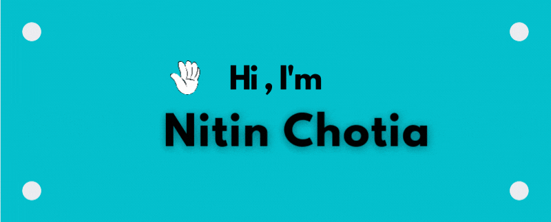

>*I am from Pune, India*

😄 I have 6+ years of experience in building Web and Mobile Applications using Angular 2+, React Native, React, TypeScript, JavaScript, HTML, CSS, JQuery, Angular Material, Firebase and Node.

1. Advanced know-how of HTML5 and CSS3.
2. Work experience in the implementation of factory design principles.
3. Creating pixel-perfect responsive UI which works across browsers and devices for websites and web applications.
4. Converting PSD to HTML using industry standards and best practices.
5. Good in troubleshooting web pages in different browsers/devices.
6. Leadership skills, positive attitude & ability to work as a strong team player, work under time constraints & handle pressure.
7. **Values** - Honesty, Flexibility, Dedication.
8. **Attitude** - Constant learning, responsibility, and belief in the capability of the team.

- 🔭 I’m currently working on react three fiber and blender
- 🌱 I’m currently learning React Native
- 👯 I’m looking to collaborate on Angular project
- 📫 How to reach me: nitinchotia2014@gmail.com
